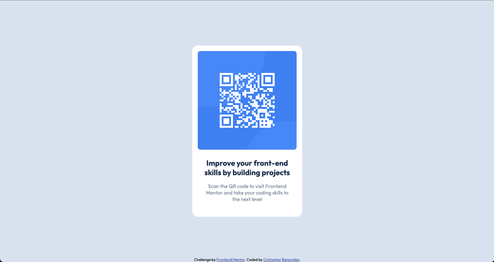

# Frontend Mentor - QR code component solution

This is a solution to the [QR code component challenge on Frontend Mentor](https://www.frontendmentor.io/challenges/qr-code-component-iux_sIO_H). Frontend Mentor challenges help you improve your coding skills by building realistic projects. 

## Table of contents

- [Frontend Mentor - QR code component solution](#frontend-mentor---qr-code-component-solution)
  - [Table of contents](#table-of-contents)
  - [Overview](#overview)
    - [Screenshot](#screenshot)
    - [Links](#links)
  - [My process](#my-process)
    - [Built with](#built-with)
    - [What I learned](#what-i-learned)
    - [Continued development](#continued-development)
    - [Useful resources](#useful-resources)
  - [Author](#author)

## Overview

### Screenshot



### Links

- Solution URL: [Github: rashier/cris-qr-code](https://github.com/rashier/cris-qr-code)
- Live Site URL: [Github Pages: cris-qr-code](https://rashier.github.io/cris-qr-code/)

## My process

### Built with

- Semantic HTML5 markup
- CSS custom properties
- Flexbox

### What I learned

I learned to better handle the use of the ```flex box``` and some positioning and margin properties.

### Continued development

I want to continue learning to improve the way I lay out web pages. In addition to learning to use the ```grid```.

### Useful resources

- [Stackoverflow](https://stackoverflow.com/questions/643879/css-to-make-html-page-footer-stay-at-bottom-of-the-page-with-a-minimum-height-b) - It helped me in how to position a section at the bottom of the page.

## Author

- Frontend Mentor - [@rashier](https://www.frontendmentor.io/profile/rashier)

